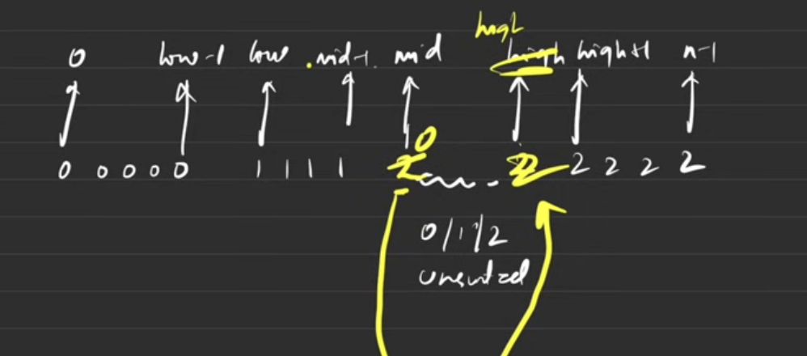

# Monday, March 31 2025

## Tasks

- [] March 31, 2025 - Task: set resume right and apply to 10 jobs(any)
- [] March 31, 2025 - Task: finish till 29 of problems(arrays)

## Notes

### Sorting an Array of 0's, 1's, and 2's (Dutch National Flag Problem)

There are several approaches to sort an array containing only 0s, 1s, and 2s. Here are the most efficient methods:

#### Method 1: Counting Sort (Simple Approach) [could also use hash map instead of normal count array]

def sort_colors_counting(nums):
    count = [0, 0, 0]
    for num in nums:
        count[num] += 1
    
    i = 0
    for color in range(3):
        for _ in range(count[color]):
            nums[i] = color
            i += 1

Time Complexity: O(n) - Two passes through the array
Space Complexity: O(1) - Constant space for the count array

#### Method 2: One-Pass Dutch National Flag Algorithm (Optimal)

def sort_colors(nums):
    low, mid, high = 0, 0, len(nums) - 1
    
    while mid <= high:
        if nums[mid] == 0:
            nums[low], nums[mid] = nums[mid], nums[low]
            low += 1
            mid += 1
        elif nums[mid] == 1:
            mid += 1
        else:                                               # nums[mid] == 2
            nums[mid], nums[high] = nums[high], nums[mid]
            high -= 1

Time Complexity: O(n) - Single pass
Space Complexity: O(1) - In-place sorting

How the Dutch National Flag Algorithm Works:

    Three Pointers:
        low - tracks where the next 0 should go
        mid - current element being processed
        high - tracks where the next 2 should go

    Process:
        When you see a 0: swap with low pointer and move both forward
        When you see a 1: just move mid forward
        When you see a 2: swap with high pointer and move high backward

When to Use Which:

    Counting Sort: When you need simplicity and don't mind two passes
    Dutch Flag Algorithm: When you need optimal one-pass solution (preferred for interviews)

Both methods are O(n) time complexity, but the Dutch National Flag algorithm is more elegant and runs in a single pass.

