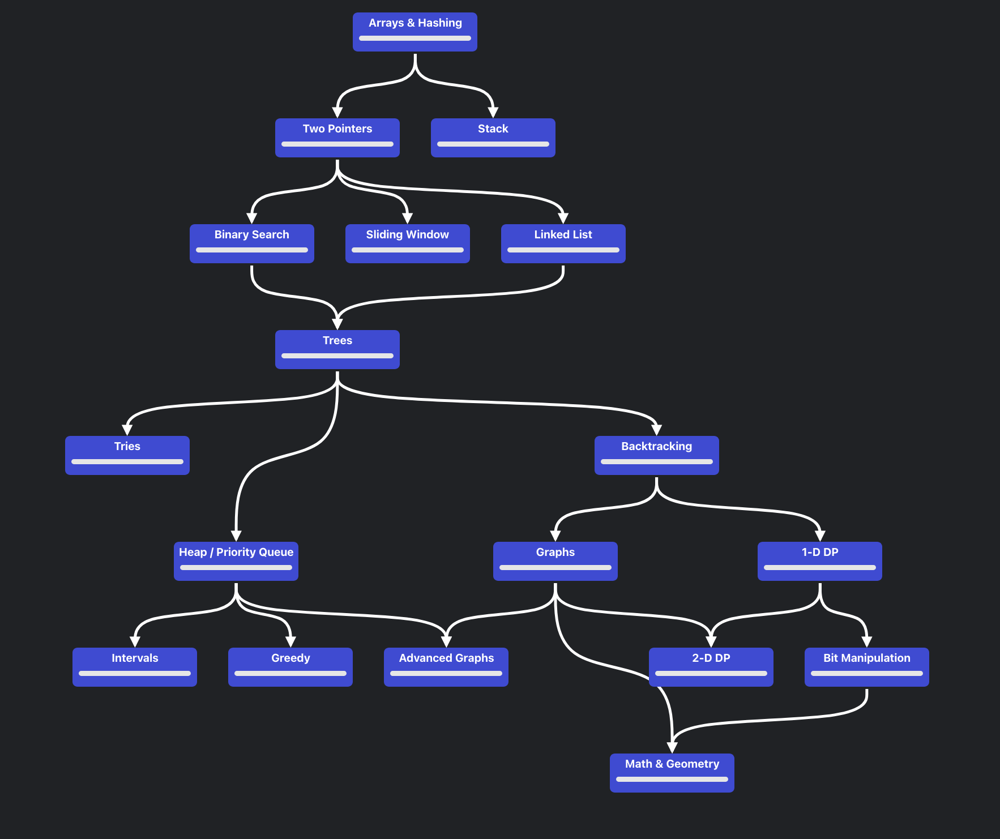

Hours Calculation

3rd april - 
. woke up - 8 am
. started sprint at 8am -> done
. start sprint at 1 pm - 4pm -> done
. start sprint at 4 pm - 5pm -> done
. start sprint at 8.20 pm - 12 pm -> done

extra 
- 20 min
- 1 hr 35 min --> 1hr 55 min
- 30 min

total hours covered - 3+3+1+3+40 min -> 10 hrs 40 min - 2hrs 30 min-> 8 hrs 10 min
not covered - 3 hrs 50 min * 2 -> 8 hrs approx

-------------------

4th april - 
. sprint 12 am - 2 am -> done
. sprint 9 pm - 12 am -> 

uncovered:
- 15 min
- 7 hours 

-------------------

5th april

6th april

-------------------

7th april

so far 10 hrs 30 mins

its 12.30 now

i'm starting 
sprint 12.30 - 
Set Matrix Zeroes Optimal 

----------------------

9th april

12 pm -> 3 pm
3->4pm resume changes
4-7pm-> call and relax and applications
7 pm -> 2 am (study)

didn't happen - only resumes were done and applied for random 10 companies

---------

10th april

8.10 -> 12 am - done
12-1 -> prepare for tmrw
1-8.30 -> slept

-----------

11th april

9.50 -> ___ 
___ -> 5.50 pm

4 hrs -> more work

-----------

13thapril 

4 pm - 10 pm 
1hr dinner break
11-... -> finish resume update to shree's resume and go through ibm report. properly write up all questions that might be asked in interview

sleep for 7.30 hrs and get up hustle again 
i'll come back here tmrw morning

-------------


```python
6th and 8th april exchange
so 6th i can work just for 6 hrs
on 8th its 12 hrs as usual

12th sat and 13th sun exchange
12th sat - wake up early
13th - wake up early
```


working days:

just 10hrs pure brain energy

10pm- 6pm

6pm - 11(5) (15 min bf break)

11-1 -> break

1-6 -> 5

6-10 -> mix of everything -- take it easy and learn things(other skills)

8+2 --> off time
14 hrs of focus


little tweak:
10-6 -> 8 hrs
6-7 -> break (food and relax)
7-10 > concetrated
10-10.15 -> break   

continue till 12/1 - sleep as you get sleep

1-8.15 sleep

focused hrs: 8+3 --> 22 problems
unfocused -> 3 hrs

sleep around 1 -> 7-8 hrs

-------------------------

Resume Preparation and application to jobs:

. You have SRE resume ready - can apply to various jobs realted to sre
. There's possibility of venturing into devops roles which would open up quite a no of possibilities ( have to learn about of tools and their usage)
. Or you could also focus of dev particularly backend but here i have learn about api's, db's, ...

Date is 26th april 2025
- Waiting for google reply to sre possition - priority 1 if i get good news i can give screening interview around may end or wait another 20 days with updated resume and apply to 3 more roles that are present. in second case too i'm hoping to schedule screeninig interview asap
- Plan B: 
    - Focus on other options and prepare accordingly. Even here i need to focus on dsa and resume preparation & job applications
    - So its reasonable to divide it 70-30 


------------------------

         
30th april 2025
woke up 7.30 , cleaned and sat around 9 am

hrs wasted:
30min


-----------------------------------

