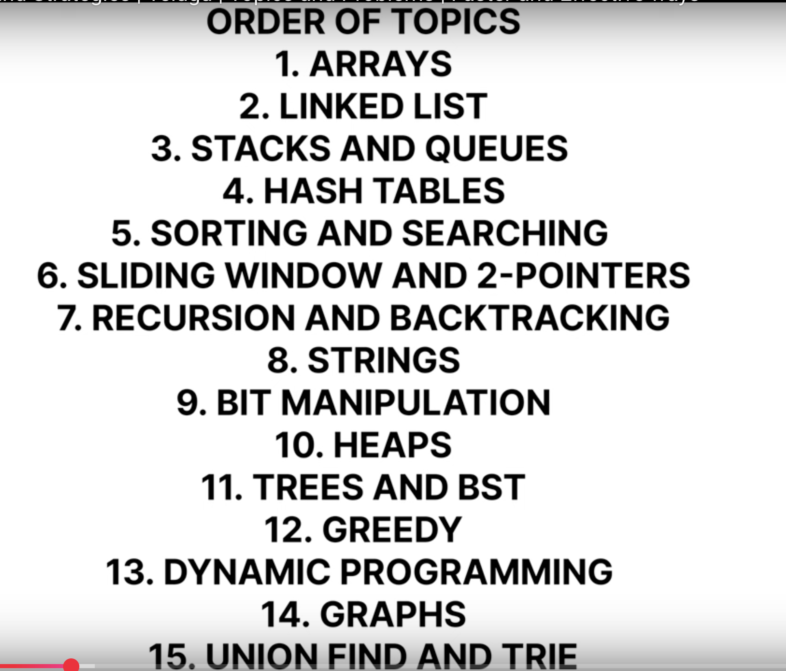

**Time table outline **

# Non working day

8 hrs sleep
Ready and house work / eating / chores 2 hrs

14 hrs preparation

Feel like every following day you have an exam at exact 9 am

# Working day

- 7hrs sleep
- Library 9 hrs
- sleep little early and wake up 
- get ready 
- eat bf and pack lunch
- 4 hrs prep at home
- 4 hrs for house work

Big Plan:
Finish the entire playlist 
resume clarity - update the resume to ats
linkedin premium

# Things to involve myself when not actively preparing
- Learning Hindi
- typing practice
- meditation
- exercise
- learn sth in cooking

## Sprints

4-11 - 7hrs
11-2 - relax
2-6..7 - 4hrs
6-8 - relax
8-12 - 4 hrs

Keep morning times mostly for mind intensive tasks
keep afternoons for applying jobs, resume correction, git and resume stuff preparing
keep nights for mix of everything

- since its preparation time keep mind at peace - 1 hr of meditation is mandatory(.5 and .5 split)

## Plan - Total 316 videos

- Till 44 - Arrays(3 Matrices)
- Binary Search (27) till 72
- Trees(53) till 125
- Graph(56) till 181
- Dynamic Programming(56) till 236
- Linked list(28) till 264
- few math problems
- greedy algo problems
- stack and queue prob

### Proceedings so far - 28th march 2024

- what i'm planning to do? 
 - first get myself comfortable with coding rounds, prepare as i appear to interviews
- what roles i'm targetting?
 - my strength is development, sre, devops roles
- resume and applications so far?
 - nothing to show for. get my resume ready and apply as per the job description

- how are you preparing for coding rounds?
 - at end of day go through all you did that day
 - maintain notes. save everything in notes and understand patterns
 - use physical writing to understand the problem and for psuedocode
 - if needed try to execute the code in practice section 

I'm giving myself 2 months of time - 60 days

- To set right my life for ever
- To learn discipline
- Exercise daily, meditate 1 hr(as a whole)
- Dig deep
- No fap
- Drink good amount of water, eat healthy
- Very less screen time

# Let me note down my shortcomings, improvement plan, 60 day plan

. if i'm sitting on one thing continuously i'm seeing progress if not i have nothing to show
. just 60 days try to develop a discipline which will be helpful for your life
. 30 min exercise for body, 1 hr meditation as mind needs more help than body

Preparation trick:
. try to run through all the videos as soon as possible. 
. when to move forward from current video:
 - written is done from video
 - coding is done
 - get content from deep seek and paste in vscode
. understand it and move forward
. dont worry if you cant think of good code or even proper code when learning. just try to have an idea that's it
. we will come back again with recap

let me divide day into 3 parts:
. 8 hour sleep - planning for 9-5
. 2 hrs for miscellaneous( here also it includes bath, food breaks, groceries shopping, preparing food)
. 1 hr for meditation, 0.5 for workout( these can act as breaks)
. total 12-13 hrs proper work without fail

3 hrs of 4 sprints with 4 breaks max - 4*3hrs-> 12 hrs

. these sprints can be arranged somehow - be adaptible

each day come here and give a tick mark that you finished 12 hrs of work and after 10th you can have one off day so basically its 66 days challenge
the day can be carried forward and can be taken any time after claiming it

after 5 days 6th day you can work for just 6 hrs and enjoy the rest of the day(i.e., 6th day). these can't be carried forward

the goal is 12 hrs or more hrs of work(cant be deviated for a min that's it. if more than that then stop the timer and start again when back to work) to be done and no fap during the challenge(can practice it or anything but no fap at all. save the content inside)

the challenge starts from 3rd april 2025(Thursday)

Consequences for failing - either the hrs / fap thing
. 30 min cold water bath
. 2 hrs meditation session
. make up for lost hours in next consecutive days only- 
 - fap one time(12 hrs of work)
 - if missed hrs then make up of double the hrs missed in next consecutive days

 If you try to make up for hours lost in consecutive days you can try to escape the pain

Exclusive things
. small things like going to washroom, getting something within 1/2 min - can be neglected(but be true to yourself and timer it if needed)
. anything that you think could take more than a min - should be noted down and balanced by end of the day

Short term goal: 6th april 
arrays
linked list
stack and queue
sort and search
bit manipulation
trees till some

### Look back at what happened

5th 6th april lost 24 hrs just like that
do you atleast remember anything u did so you can sleep well at night
i think its important to dig deep. force yourself to sit for 15-30 min and then see the magic happen

lets start again for serious now.. dont burn out and dont think too much of yourself. this 7 days dont miss any day lets see what happens. no short term goals as well see what you achieved after 7 days. nothing changes alright

starting today : 7th april monday

wake up around 3.45 am - get ready
start at 4 am - 10 am
eat 
start from 10.30 - 3 pm
cook around 3-6 pm
resume and applications after 6 

in the image:
1->9 its arrays and linkedlist
10->

Weeks 1-2:  Arrays, LL, Stacks/Queues, Hash Tables
Weeks 3-4:  Sorting, Searching, 2-Pointers/sliding window
Week 5:     Strings, Bit Manipulation                   -->     Friday till 11.59 pm

Week 6:     Heaps, Basic Trees , maybe recursion here dont know
Week 7:     Advanced Trees/BST --> stop here    wed 23rd april

Week 8:     Backtracking
Weeks 9-10: Dynamic Programming --> stop here    2nd may friday

Week 11:    Greedy, Graph Basics
Week 12:    Advanced Graphs, Union Find/Trie --> 11th may sunday -> revise everything in this period

45 min per problem
315 videos

236 hrs total

20 days - per day 12 hrs

-------------------------------------

Wasted 14th april to max and got realization .. seriously

. dont watch content
. doesn't matter 24 hrs focus on interview preparation
. free time if only needed essentially - meditation, workout, go out if needed, kitchen work, grooming(bath), sleep if needed
. dont be afraid to put all your energy in interviews - dont think its not healthy
. play it like a game

i have only 24 hrs - 7 hrs sleep, food and stuff(1 hr)
other 16 hrs goes to studies

this routine until priya returns

------------------------------------

Try to enjoy what you are doing - too much planning is fucking my head
but follow the core process of tackling a problem

New 21 day plan:
8 hrs sleep
2 hrs for food and preparation

14 hrs left - something related to job search

plan next day on end of previous day

test the limit of your focus - its possible as you did the same in hyd for 1 year

so above plan wrks with sole motivation which i dont have currently as i dont have any job intervies lined up

lets realistically plan this shit out:

-----------------------

Final plan (Open to little alterations) - 21 day plan( 3 weeks ) Starting monday 19th May 2025

Rules:
. dont watch yt or linkedin(useful) whatsoever. starve yourself of dopamine. get it in healthy ways(shower, meditation, cleaning, roaming, spending time with gf,) ever atleast until you get a job.
. start waking up early(4 am)
. only focus on studies
. use laptop only for coding
. no laptop/screen usage during sleep

Plan:
- dont have clear plan. it may change on daily basis.
- overall try to finish whatever is in takeyouforward playlist. focus on intuition in neetcode
- keep applying to jobs. alter resumes as per job
- prepare for whatever is in resume

Mistakes:
- not intitating the work and just dumb scrolling yt
- its okay if you get rejections. remember just focus on controllables

everyday
5-11 ( 6 hrs )
1-6 ( 5 hrs ) -> library mon-fri
6-9 (resume, applications) - 3 hrs

how to properly solve a problem
. try to think and jot down whatever comes to mind of all the possibilities 
. get to know the intuition and psudo code from video
. then deepseek after understanding the logic of all three approaches
. implement optimal solution by writing/coding from scratch
. write down 3 questions that are essential for the problem and answer them. then move on

Half weekly target:

wed - thu - fri

40 videos - trees rem
finish maha bharat book

be good with trees as much as possible - till hard problems

come up with some strategy to applications

----------------------------------------

31 days schedule

only small breaks during her holiday

